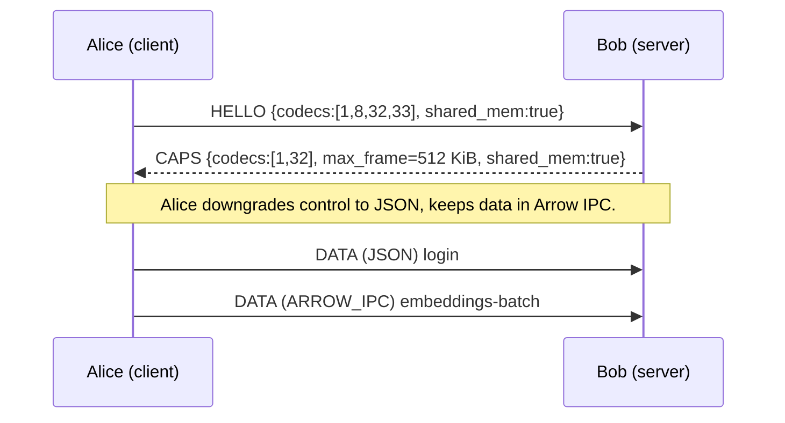

<!---
Copyright © 2025 Maida.AI contributors
Licensed under CC-BY-4.0 <https://creativecommons.org/licenses/by/4.0/>
-->

# XCP Implementation Guide

Version: 0.2

> **Status:** _non-normative companion_ to the **XCP v0.2** specification.
> Focus = *how* to build an interoperable stack; the spec and
> [`xcp-v0.2-codecs.md`](./xcp-v0.2-codecs.md) remain the normative source for
> on-the-wire details.

## What's inside this guide -- at a glance

| Section | You'll learn ... |
|---------|----------------|
| 1. [Prerequisites](#1-prerequisites) | Toolchain & suggested repo layout |
| 2. [Control-plane (Protobuf)](#2-control-plane--protobuf) | `.proto`, compile command, HELLO example |
| 3. [Data-plane codecs](#3-data-plane-codecs) | JSON, **PROTOBUF `0x0008`**, **ARROW IPC `0x0020`**, **DLPack `0x0021`**, TENSOR_* |
| 4. [Shared-memory fast path](#4-shared-memory-fast-path) | mmap handles & flow |
| 5. [Capability negotiation flow](#5-capability-negotiation-flow) | Sequence diagram |
| 6. [Inter-language tips](#6-inter-language-tips) | Library names for Py/Go/Rust |
| 7. [Testing matrix](#7-testing-matrix) | Scenarios & expected results |
| 8. [Road-map tags](#8-roadmap-tags) | P0->P2 implementation phases |

## 1 Prerequisites

| Tool / Library        | Min version | Purpose                              |
|-----------------------|------------:|--------------------------------------|
| **Python**            | 3.10        | Reference runtime                    |
| `protobuf` compiler   | `protoc $\geq$ 25`| Codegen for control/data messages    |
| **PyArrow**           | 12.0        | Arrow IPC helpers (codec `0x0020`)   |
| **Cap'n Proto**       | 0.10        | Frame-header struct encoding         |
| `google-crc32c`       | 1.5         | CRC32C footer check                  |
| **zstd**              | 1.5         | Compression for `COMP` flag          |
| **DLPack** (py)       | `dlpack-python` | GPU tensor exchange (codec `0x0021`) |

### Suggested repo layout

```
proto/            # .proto sources
xcp/              # Python package
├── framing.py
├── ether.py
├── codecs/
│   ├── json.py
│   ├── protobuf.py
│   ├── arrow\_ipc.py
│   └── dlpack.py
└── control/
examples/
```

## 2 Control Plane -- Protobuf

### 2.1 `.proto` definitions

```protobuf
// proto/control.proto
syntax = "proto3";
package xcp.control;

message Hello {
  repeated uint16  codecs          = 1; // supported bodyCodec IDs
  uint32           max_frame_bytes = 2;
  repeated KindRange accepts       = 3; // inbound kinds
  repeated KindRange emits         = 4; // outbound kinds
  bool             shared_mem      = 5;
}

message KindRange {
  uint32 kind_id    = 1;
  uint16 major      = 2;
  uint16 min_minor  = 3;
  uint16 max_minor  = 4;
}

message Ack  { uint64 msg_id = 1; }
message Nack { uint64 msg_id = 1; uint32 error_code = 2; uint32 retry_after_ms = 3; }
message Ping { uint64 nonce  = 1; }
message Pong { uint64 nonce  = 1; }
```

Generate stubs:

```bash
protoc \
  --python_out=xcp/generated \
  --go_out=xcp/generated \
  proto/control.proto
```

Import in `framing.py`:

```python
from xcp.generated import control_pb2 as pb
```

### 2.2 Sending a **HELLO** frame

```python
hello = pb.Hello(
    codecs=[0x0001, 0x0008, 0x0020, 0x0021],   # JSON, PROTOBUF, ARROW_IPC, DLPACK
    max_frame_bytes=1 << 20,
    shared_mem=True,
    accepts=[pb.KindRange(kind_id=0x6EA7E21B, major=1, min_minor=0, max_minor=5)],
)
body = hello.SerializeToString()
frame = build_frame(msg_type=MSG_HELLO,
                    body_codec=CODEC_PROTOBUF,   # 0x0008
                    body=body)
writer.write(frame)
```

## 3 Data Plane Codecs

> **Normative constants & header layouts** live in
> [`xcp-v0.2-codecs.md`](./xcp-v0.2-codecs.md).
> Below you'll find *working Python snippets*.

### 3.1 `0x0001 JSON` (baseline)

```python
import json
encoded = json.dumps(eth.model_dump(), separators=(',', ':')).encode()
```

Use only when payload $\leq$ \~2 kB or for debugging.

### 3.2 `0x0008 PROTOBUF` (**EtherProto**)

`.proto` lives in `proto/ether.proto` and mirrors the Pydantic `Ether` class.
Minimal encoder:

```python
from xcp.generated import ether_pb2 as ep
from xcp.ether import Ether

def encode(eth: Ether) -> bytes:
    msg = ep.EtherProto(
        kind           = eth.kind,
        schema_version = eth.schema_version,
    )
    msg.payload.update(eth.payload)
    msg.metadata.update(eth.metadata)
    msg.extra_fields.update(eth.extra_fields)
    # attachments ...
    return msg.SerializeToString()
```

### 3.3 `0x0020 ARROW_IPC` (columnar batches)

```python
import pyarrow as pa, pyarrow.ipc as ipc

rows = [e.model_dump() for e in ether_batch]   # list[dict]
table = pa.Table.from_pylist(rows)
buf   = ipc.write_table(table).to_pybytes()
```

Recommended frame cap: **512 KiB WAN / 4 MiB LAN**.

### 3.4 `0x0021 DLPack` (GPU tensors)

```python
import torch, dlpack, struct
from xcp.codecs.tensor import build_tensor_header

caps = torch_tensor.to_dlpack()
hdr  = build_tensor_header(torch_tensor)   # 32-byte little-endian struct
payload = hdr + dlpack.to_bytes(caps)      # append capsule
```

### 3.5 TENSOR\_\* (`0x0002` F32, `0x0003` F16, `0x0004` INT8)

Header layout = **Table A-3** in codec appendix (32 bytes, LE).

## 4 Shared-Memory Fast-path

1. Both peers advertise `shared_mem=true` in **HELLO/CAPS**.
2. Sender places Arrow IPC stream in a POSIX-SHM file.
3. Frame body contains **URI** only:

   ```
   shm://arrow/batch-{uuid}#<offset>,<size>
   ```
4. Receiver `mmap`s same region -> zero-copy Arrow reader.
5. Lifetime: sender unlinks SHM after receiving `ACK`.

260 k x 768-float32 vectors drop copy time **65 ms -> 4 ms** on the same host.

## 5 Capability Negotiation Flow



## 6 Inter-language Tips

| Language | Protobuf                     | Arrow             | CRC32C          | Cap'n Proto              | DLPack                                                                                                 |
| -------- | ---------------------------- | ----------------- | --------------- | ------------------------ | ------------------------------------------------------------------------------------------------------ |
| Python   | `protobuf`                   | `pyarrow`         | `google-crc32c` | `py-capnp`               | `dlpack-python`                                                                                        |
| Go       | `google.golang.org/protobuf` | `apache/arrow/go` | `hash/crc32`    | `capnproto.org/go/capnp` | [https://github.com/pytorch/experimental-dlpack-go](https://github.com/pytorch/experimental-dlpack-go) |
| Rust     | `prost`                      | `arrow2`          | `crc32fast`     | `capnp` crate            | `tch-dlpack`                                                                                           |

## 7 Testing Matrix

| Scenario             | Codec              | Size      | Expected result                         |
| -------------------- | ------------------ | --------- | --------------------------------------- |
| Ping/Pong            | JSON               | < 1 kB    | Response within RTT                     |
| 100 x 768-vec batch  | ARROW IPC          | $\approx$ 310 kB  | CRC OK, < 20 ms LAN                     |
| 8 MiB tensor         | TENSOR\_F32 + COMP | 8 -> 2 MiB | Recompose, CRC passes                   |
| Unsupported codec ID | --                  | --         | Peer sends `NACK ERR_CODEC_UNSUPPORTED` |

Automate with **pytest-asyncio** + Hypothesis.

## 8 Road-map Tags

| Phase  | Milestone                                                               |
| ------ | ----------------------------------------------------------------------- |
| **P0** | JSON, PROTOBUF control, CRC32C, zstd COMP                               |
| **P1** | ARROW IPC encode/decode, shared-memory handles (`shm://`)               |
| **P2** | DLPack GPU tensors, Arrow Flight streaming, INT8 quantised TENSOR codec |

*Last updated 2025-07-29 -- keeps parity with `xcp-v0.2-codecs.md` and XCP v0.2.*
